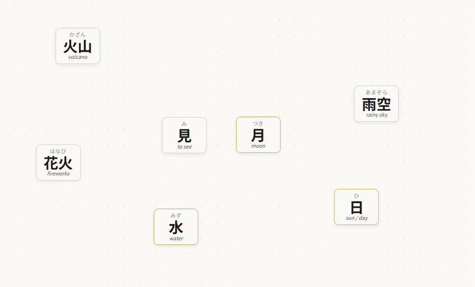
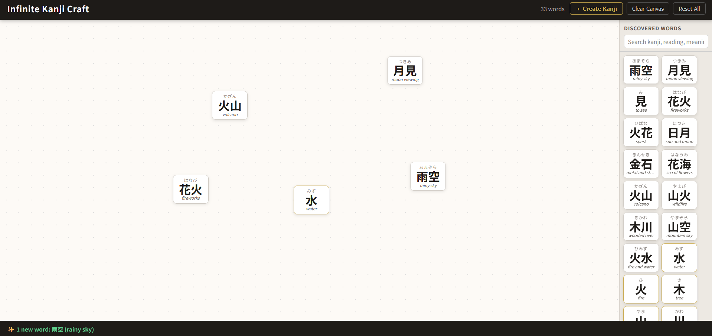

# Infinite Kanji Craft



A Japanese language learning game inspired by [Infinite Craft](https://neal.fun/infinite-craft/). Drag kanji tiles together to discover new words, learn their readings, and explore how the Japanese language builds meaning through combination.

## 

## How to Play

### Starting Up

The game requires a local HTTP server — browser security blocks the Jisho API from `file://` origins.

Go to the directory and run:

```bash
python3 -m http.server 8000
```

Then open **http://localhost:8000** in your browser.

### Core Mechanic — Combining Tiles

Each tile shows three things:

```
┌──────────┐
│  かざん  │  ← furigana (hiragana reading)
│   火山   │  ← kanji
│ volcano  │  ← English meaning
└──────────┘
```

**Drag one tile on top of another** to combine them. The app searches for all real Japanese words that can be formed from those two kanji — checking both orderings and both the native (kun-yomi) and Chinese-derived (on-yomi) readings in parallel. Every matching word appears on the canvas at once.

> **Example:** 花 + 火 → the app searches はなひ, ひはな, 花火, and 火花 simultaneously → finds **花火** (はなび, _fireworks_) and **火花** (ひばな, _spark_), and places both tiles

If no word is found, both tiles bounce back to their original positions.

### Creating Custom Tiles

Click **＋ Create Kanji** in the header to add any kanji to your collection:

1. Type a romaji reading (e.g. `mi`, `hoshi`, `kokoro`)
2. A live hiragana preview appears as you type
3. Press **Enter** or click **Create**
4. A matching kanji tile is placed on the canvas and saved to your sidebar

This unlocks combinations not possible with the 20 starters alone. For example, create 見 (`mi`) then combine it with 月 to discover **月見** (_tsukimi_ — moon viewing), or with 花 for **花見** (_hanami_ — flower viewing).

If multiple kanji share the same reading (e.g. `mi` → 見, 身, 実…), one is chosen at random each time — so creating the same reading again may yield a different kanji.

### Sidebar

The right panel is your **word collection**. Every word you discover is saved here permanently. You can:

- **Drag any sidebar tile onto the canvas** to use it again — the sidebar copy stays put
- **Search** by kanji, reading, or English meaning using the search box
- **Drag a canvas tile over the sidebar** to remove it from the canvas without deleting it from your collection

### Buttons

| Button              | Action                                                     |
| ------------------- | ---------------------------------------------------------- |
| **＋ Create Kanji** | Open the romaji input modal to create a custom tile        |
| **Clear Canvas**    | Remove all tiles from the canvas (your collection is kept) |
| **Reset All**       | Wipe everything and start fresh with the 20 starter tiles  |

### Progress

Your entire collection and canvas layout are automatically saved to `localStorage` with a short debounce after every action. Closing or refreshing the browser preserves your progress. **Reset All** is the only way to erase it.

---

## Starter Tiles

The game begins with 20 fundamental kanji chosen for their combinability:

| Kanji | Reading | Meaning  |     | Kanji | Reading | Meaning   |
| ----- | ------- | -------- | --- | ----- | ------- | --------- |
| 水    | みず    | water    |     | 金    | きん    | gold      |
| 火    | ひ      | fire     |     | 日    | ひ      | sun / day |
| 木    | き      | tree     |     | 月    | つき    | moon      |
| 山    | やま    | mountain |     | 草    | くさ    | grass     |
| 川    | かわ    | river    |     | 雨    | あめ    | rain      |
| 人    | ひと    | person   |     | 雪    | ゆき    | snow      |
| 空    | そら    | sky      |     | 光    | ひかり  | light     |
| 土    | つち    | earth    |     | 夜    | よる    | night     |
| 風    | かぜ    | wind     |     | 花    | はな    | flower    |
| 海    | うみ    | sea      |     | 石    | いし    | stone     |

Note: 火 and 日 both read ひ — combining either with another tile searches all possible combinations, so both fire-compounds and sun/day-compounds can appear from the same drag.

### Combinations to Try First

| Combine | Result                                            |
| ------- | ------------------------------------------------- |
| 花 + 火 | 花火 (はなび) — fireworks · 火花 (ひばな) — spark |
| 火 + 山 | 火山 (かざん) — volcano                           |
| 水 + 海 | 湖 (みずうみ) — lake                              |
| 月 + 光 | 月光 (げっこう) — moonlight                       |
| 日 + 光 | 日光 (にっこう) — sunlight / Nikko                |
| 夜 + 空 | 夜空 (よぞら) — night sky                         |
| 風 + 水 | 風水 (ふうすい) — feng shui                       |
| 草 + 花 | 草花 (くさはな) — plants and flowers              |

Then create 見 (`mi`) and combine it with 月 for **月見**, with 花 for **花見**, or with 雪 for **雪見**.

---

## Project Structure

```
infiniteJapanese/
├── index.html      — App shell, layout, Create Kanji modal
├── style.css       — All styles and animations
├── storage.js      — localStorage save / load / clear
├── dictionary.js   — Jisho API lookup, offline fallback data, romaji→kana converter
├── tiles.js        — Tile DOM creation and pointer-event drag-and-drop
└── app.js          — Game state, combine logic, Create Kanji modal, initialization
```

No framework, no build step, no dependencies. Every file is plain JavaScript that runs directly in the browser.

### storage.js

Thin wrapper around `localStorage` under the key `infiniteJapanese_v1`:

```json
{
  "version": 1,
  "discoveredWords": {
    "word_花火_はなび": {
      "kanji": "花火",
      "readingKana": "はなび",
      "meaning": "fireworks"
    }
  },
  "canvasInstances": [
    {
      "instanceId": "inst_...",
      "wordId": "word_花火_はなび",
      "x": 300,
      "y": 200
    }
  ]
}
```

### dictionary.js

**Four parallel searches per combination.** When tiles A and B are combined, the app fires up to four Jisho API queries simultaneously:

| Query                    | Finds                                                                               |
| ------------------------ | ----------------------------------------------------------------------------------- |
| kana A+B (e.g. `つきみ`) | words whose reading is exactly `つきみ`                                             |
| kana B+A (e.g. `みつき`) | words in the other order (e.g. 三月)                                                |
| kanji A+B (e.g. `月見`)  | words written with those exact kanji — catches on-yomi compounds like 月見 (つきみ) |
| kanji B+A (e.g. `見月`)  | reversed kanji compound                                                             |

All results are deduplicated and returned as an array — every matching word is shown at once. Results are cached per combination so repeated combines are instant.

If all API calls fail (offline or CORS), the inline `FALLBACK_DATA` object is checked. It contains ~220 entries: kana-keyed entries for kun-yomi compounds, kanji-keyed entries for on-yomi compounds (火山, 月光, 花見…), and ~50 single-kanji entries for the Create Kanji feature.

Also contains `romajiToHiragana(str)` — a longest-match Hepburn converter covering compound kana (sha, chi, tsu, kya…) and consonant gemination (tt → っ).

### tiles.js

Each tile is a `<div class="tile">` with three children:

```
.tile-furigana  — hiragana reading (top)
.tile-kanji     — kanji character(s) (centre)
.tile-meaning   — English gloss (bottom)
```

Drag-and-drop uses the [Pointer Events API](https://developer.mozilla.org/en-US/docs/Web/API/Pointer_events) (`pointerdown` / `pointermove` / `pointerup` + `setPointerCapture`) rather than the HTML5 Drag API, giving reliable cross-browser behaviour and clean overlap detection via `document.elementsFromPoint`.

Canvas tiles are `position: absolute` inside `#canvas`. Sidebar tiles use normal flow. Dragging from the sidebar creates a floating clone that follows the pointer; the sidebar original never moves.

### app.js

Owns the game state (`discoveredWords`, `canvasInstances`) and orchestrates everything else:

- **`attemptCombine(dragTileData, targetEl)`** — fires all four searches in parallel, places every result tile spread horizontally around the midpoint, updates the sidebar and status bar
- **`resultPositions(midX, midY, count, w, h)`** — distributes result tiles in a centred row, clamped to the canvas bounds
- **`initCreateModal()`** — wires the Create Kanji button, live romaji→kana preview, and single-tile async creation
- **`initStarters()`** / **`restoreState()`** — first-load seeding and localStorage hydration
- **`initSearch()`** — client-side filter on the sidebar collection

---

## Technologies

| Layer         | Technology                                                                                                              |
| ------------- | ----------------------------------------------------------------------------------------------------------------------- |
| Language      | Vanilla JavaScript (ES2020) — no transpilation, no bundler                                                              |
| Markup        | HTML5                                                                                                                   |
| Styling       | CSS3 — Grid, custom properties, keyframe animations                                                                     |
| Fonts         | [Noto Sans JP](https://fonts.google.com/noto/specimen/Noto+Sans+JP) via Google Fonts; system Japanese fonts as fallback |
| Dictionary    | [Jisho API](https://jisho.org/api/v1/search/words) — free, unauthenticated public REST API                              |
| Persistence   | `localStorage`                                                                                                          |
| Drag-and-drop | [Pointer Events API](https://developer.mozilla.org/en-US/docs/Web/API/Pointer_events)                                   |
| Dev server    | `python3 -m http.server` (any static file server works)                                                                 |

---

## Offline Mode

The app is fully playable without internet using the inline fallback data. All combinations between the 20 starters and the ~50 common single-kanji entries (used by Create Kanji) are covered. The Jisho API is only needed to discover words beyond what the fallback includes.

---

## Extending the Game

**Add offline fallback entries** — add to `FALLBACK_DATA` in `dictionary.js`:

```js
// Kana key — for kun-yomi or rendaku compounds
"はなひ": { kanji: "花火", readingKana: "はなび", meaning: "fireworks" },

// Kanji key — for on-yomi compounds the kana path would miss
"火山":   { kanji: "火山", readingKana: "かざん", meaning: "volcano" },
```

**Add starter tiles** — append to `STARTERS` in `app.js`:

```js
{ kanji: "火", readingKana: "ひ", meaning: "fire" },
```
